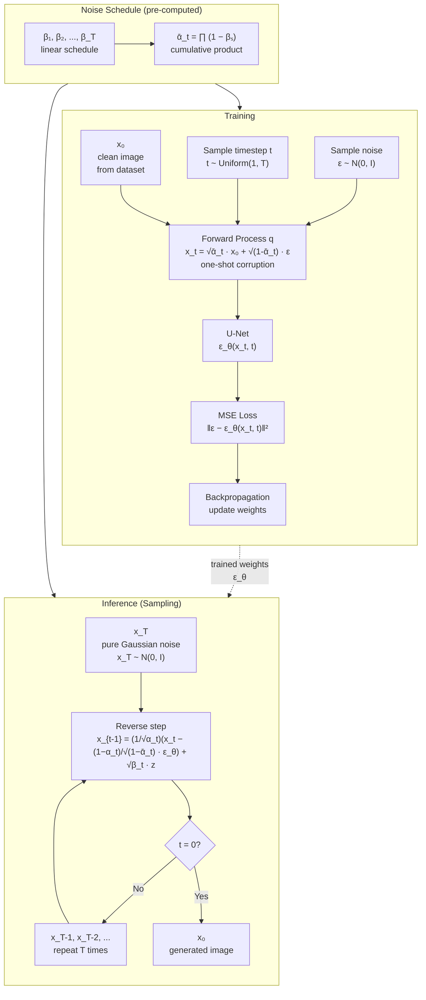

# DDPM — Full Flow Diagram

```mermaid
flowchart TB
    subgraph TRAIN["Training"]
        direction TB
        A["x₀\nclean image\nfrom dataset"]
        B["Sample timestep t\nt ~ Uniform(1, T)"]
        C["Sample noise\nε ~ N(0, I)"]
        D["Forward Process q\nx_t = √ᾱ_t · x₀ + √(1-ᾱ_t) · ε\none-shot corruption"]
        E["U-Net\nε_θ(x_t, t)"]
        F["MSE Loss\n‖ε − ε_θ(x_t, t)‖²"]
        G["Backpropagation\nupdate weights"]

        A --> D
        B --> D
        C --> D
        D --> E
        E --> F
        F --> G
    end

    subgraph SCHEDULE["Noise Schedule (pre-computed)"]
        direction LR
        S1["β₁, β₂, ..., β_T\nlinear schedule"]
        S2["ᾱ_t = ∏ (1 − βₛ)\ncumulative product"]
        S1 --> S2
    end

    subgraph SAMPLE["Inference (Sampling)"]
        direction TB
        P1["x_T\npure Gaussian noise\nx_T ~ N(0, I)"]
        P2["Reverse step\nx_{t-1} = (1/√α_t)(x_t − (1−α_t)/√(1−ᾱ_t) · ε_θ) + √β_t · z"]
        P3{"t = 0?"}
        P4["x_T-1, x_T-2, ...\nrepeat T times"]
        P5["x₀\ngenerated image"]

        P1 --> P2
        P2 --> P3
        P3 -- No --> P4
        P4 --> P2
        P3 -- Yes --> P5
    end

    SCHEDULE --> TRAIN
    SCHEDULE --> SAMPLE
    TRAIN -. "trained weights\nε_θ" .-> SAMPLE
```
